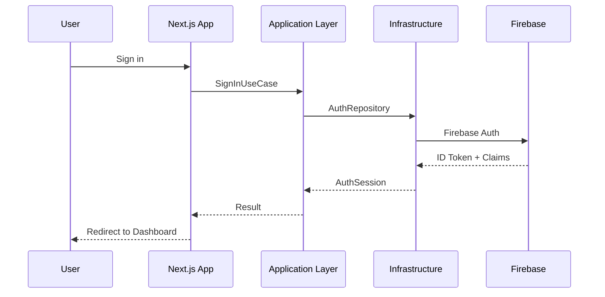

# System Design

## High-Level Flow

## Bootstrap Flow

1. User signs up and verifies email
2. Onboarding creates default `organizations` document
3. `memberships` document links user as Owner
4. `syncUserClaims` Cloud Function sets custom claims
5. Client refreshes token and enters dashboard

## Collections (Phase 1)

- `organizations` — tenant metadata
- `memberships` — user ↔ org ↔ role
- `users` — profile mirror
- `auditLogs` — immutable audit trail

## Future Modules

Customers, Vehicles, Inventory, POS, Payroll, Mechanics, Notifications, Analytics — see [ROADMAP.md](ROADMAP.md).
